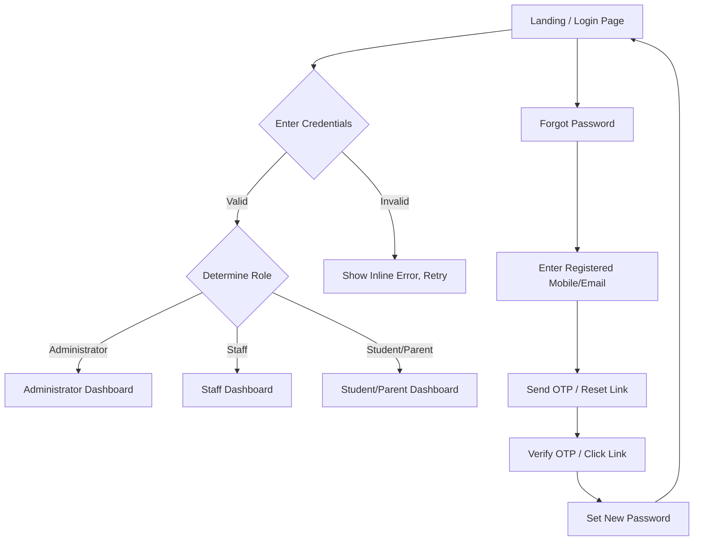
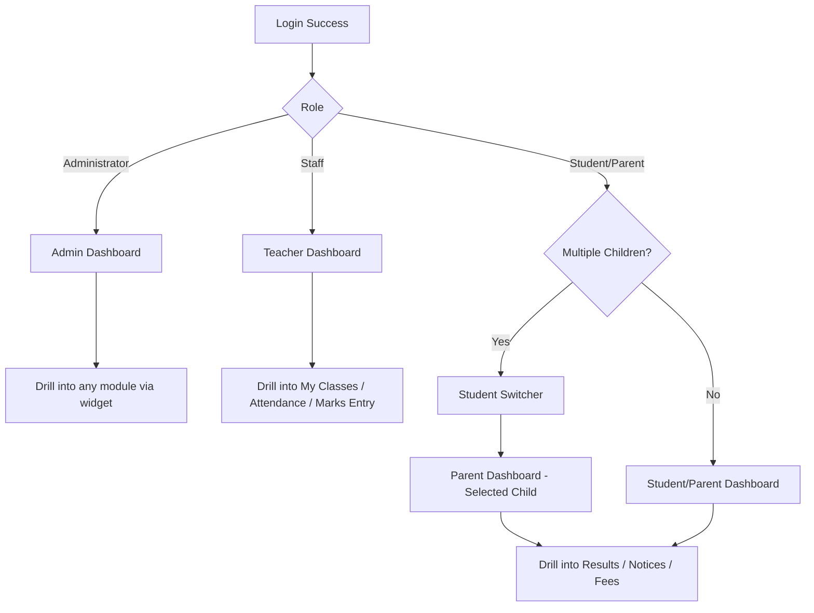
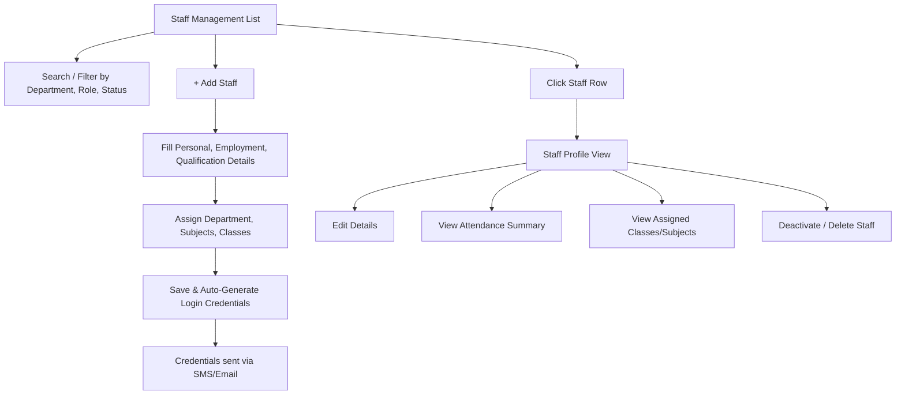
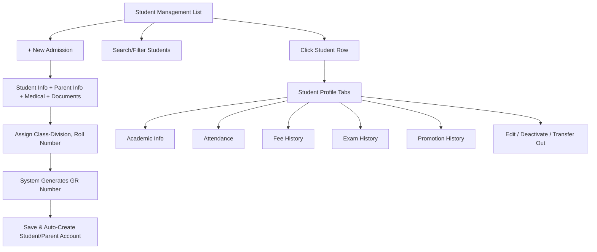

# Product Requirements Document (PRD)
# Shree Dhaneshkumar Jasvantlal Maheta High School — ERP System

**Document Type:** Enterprise SaaS Product Requirements Document
**Prepared For:** Shree Dhaneshkumar Jasvantlal Maheta High School, Bhavnagar, Gujarat, India (Est. 1959)
**Document Status:** Draft v1.0 — Implementation Ready
**Prepared By:** Product & Engineering Strategy Office
**Confidentiality:** Internal / Vendor-Confidential

---

## Document Control

| Field | Value |
|---|---|
| Product Name | SDJM High School ERP |
| Client | Shree Dhaneshkumar Jasvantlal Maheta High School |
| Location | Bhavnagar, Gujarat, India |
| Established | 1959 |
| Document Owner | Product Management Office |
| Intended Audience | Product Managers, UI/UX Designers, Frontend Engineers, Backend Engineers, QA Engineers, DevOps Engineers, Database Architects, Project Managers |
| Delivery Model | Multi-tenant capable SaaS, single-tenant initial deployment |
| Chapter Delivery Note | This PRD is delivered chapter-by-chapter due to its size. Reply **"Continue from Chapter X"** to receive the next chapter. |

---

## Table of Contents

0. Executive Summary, Assumptions, Glossary, Dependencies, Risks (this chapter)
1. Authentication Module
2. Dashboard Module (Administrator, Teacher, Student, Parent)
3. Staff Management Module
4. Student Management Module
5. Complaint Management Module
6. Admission Inquiry Module
7. Examination Management Module
8. Timetable Management Module
9. Fee Management Module
10. Staff Attendance Module
11. Student Attendance Module
12. Announcement Management Module
13. Role-Based Access Control (RBAC) Matrix
14. End-to-End User Flows & Mermaid Diagrams
15. Screen Specifications (Global Patterns + Per-Screen Detail)
16. Non-Functional Requirements
17. Notifications Framework
18. Reports Catalogue
19. Analytics Requirements
20. UI/UX Design System
21. Acceptance Criteria Summary (Cross-Module)
22. Future Roadmap
23. Implementation Notes, Data Model Summary, Glossary Appendix

---

# CHAPTER 0 — EXECUTIVE SUMMARY, SCOPE, ASSUMPTIONS, DEPENDENCIES, RISKS

## 0.1 Executive Summary

Shree Dhaneshkumar Jasvantlal Maheta High School, established in 1959 in Bhavnagar, Gujarat, is a heritage educational institution seeking to digitally transform its academic and administrative operations. This PRD defines a production-ready, multi-role School ERP System that centralizes staff management, student lifecycle management, examinations, timetabling, fee collection, attendance, complaint handling, admission inquiries, and school-wide communication into a single, secure, cloud-hosted platform.

The product is designed with the visual and interaction quality of modern SaaS products (Google Workspace, Microsoft 365, Notion, Linear, Stripe Dashboard, Apple HIG, Vercel Dashboard) rather than legacy ERP interfaces — prioritizing clarity, speed, minimal clicks, and trustworthy, premium visual design while honoring the institution's heritage identity through a Royal Blue and Golden Yellow brand language.

The system supports three primary roles — **Administrator (Principal)**, **Staff (Teacher)**, and **Student/Parent** — each with a purpose-built, permission-scoped experience across Desktop, Tablet, and Mobile.

## 0.2 Business Goals

| Goal | Description | Success Metric |
|---|---|---|
| Centralize records | Single source of truth for student, staff, fee, and exam data | 100% of active students/staff onboarded within 60 days of go-live |
| Reduce paperwork | Replace manual registers with digital attendance, marks, and fee records | ≥90% reduction in paper attendance/marks registers within 2 terms |
| Improve transparency | Give parents/students real-time visibility into attendance, results, dues | ≥80% parent portal activation within first term |
| Improve administrative efficiency | Automate timetable conflict detection, fee reminders, result computation | ≥50% reduction in admin hours spent on scheduling and reporting |
| Improve communication | Centralize notices/announcements with delivery tracking | ≥95% notice read-acknowledgment rate within 48 hours |

## 0.3 In-Scope (Phase 1 / MVP)

All 12 modules listed in the Table of Contents (Authentication through Announcement Management), including RBAC, core reporting, notifications (Email, SMS, In-App), and responsive web application (desktop/tablet/mobile browser). Native mobile apps are explicitly **out of scope** for Phase 1 and listed under the Future Roadmap (Chapter 22).

## 0.4 Out-of-Scope (Phase 1)

- Native iOS/Android apps (web-responsive only in Phase 1)
- Online payment gateway integration (fee status tracked; online collection is a Phase 2 item)
- Biometric/RFID/QR attendance hardware integration
- Library, Transport, Hostel, Inventory, HR & Payroll modules
- AI-based analytics/predictions
- Multi-school / multi-branch tenancy (architecture should not preclude it, but UI/config is single-school for Phase 1)

## 0.5 Assumptions

1. The school operates on a single academic year cycle (June–April, per Gujarat state academic calendar) configurable by the Administrator.
2. Classes follow the Gujarat State Education Board structure (e.g., Std 1–12, divisions A/B/C, etc.), but the class/division/section model must be configurable, not hardcoded.
3. Each student belongs to exactly one class-division at a time; historical class-division membership is retained for promotion history.
4. Each staff member may teach multiple subjects across multiple classes; class-teacher assignment is one class-division per teacher per academic year (configurable exception process for co-class-teachers).
5. Fee structures vary by class/standard and may include one-time and installment-based components.
6. The institution has reasonably reliable internet connectivity at the administrative office; the system should still gracefully degrade (loading/skeleton states, retry logic) for lower-bandwidth conditions common in Tier-2/3 India.
7. Primary language is English for the ERP interface in Phase 1; Gujarati/Hindi localization is a Phase 2 enhancement (see Localization in Chapter 16).
8. SMS and Email are the primary Phase 1 notification channels; WhatsApp is Phase 2 (Chapter 22).
9. The school will designate one or more Administrator accounts (Principal and delegated admin staff) with full-system access.
10. Data residency: hosted in India-region cloud infrastructure to comply with data protection expectations for student PII.

## 0.6 Key Dependencies

| Dependency | Type | Owner | Notes |
|---|---|---|---|
| SMS Gateway Provider | External | Vendor/DevOps | Required for OTP, fee reminders, attendance alerts |
| Email Service Provider (SMTP/API, e.g., transactional email service) | External | DevOps | Required for password reset, receipts, reports |
| Cloud Hosting (India region) | Infrastructure | DevOps | Data residency requirement |
| PDF Generation Service | Internal/Library | Backend | Receipts, report cards, timetables |
| Object Storage (documents/photos) | Infrastructure | DevOps | Student documents, staff documents, attachments |
| Academic Year / Board Calendar Config | Business Input | School Administration | Must be finalized before Student Management build |
| Fee Structure Finalization | Business Input | School Administration | Required before Fee Management module UAT |

## 0.7 Risks & Mitigations

| Risk | Impact | Likelihood | Mitigation |
|---|---|---|---|
| Low digital literacy among some parents | Reduced portal adoption | Medium | Simple UI, SMS fallback for critical alerts, in-person onboarding sessions |
| Data migration errors from existing paper/Excel records | Incorrect student/fee history | Medium | Structured import templates (Chapter on Import), validation + staged import with admin review |
| Connectivity issues during attendance/exam entry | Data entry delays | Medium | Offline-tolerant UI patterns (local draft save), retry queues |
| Fee data sensitivity / privacy breach | Reputational & legal risk | Low-Medium | RBAC enforcement, encryption at rest/in transit, audit logs (Chapter 16) |
| Scope creep toward legacy ERP UX patterns | Poor adoption, slow performance | Medium | Enforce UI/UX Design System (Chapter 20) in design reviews |
| Incorrect exam grade computation rules | Wrong results published | Low | Configurable grading engine with QA sign-off before each exam's result publishing |

## 0.8 Glossary (Preview — full glossary in Chapter 23)

| Term | Definition |
|---|---|
| GR Number | General Register Number — a permanent, school-issued unique student identifier retained across all academic years at the institution |
| Roll Number | Class-and-year-scoped sequential student identifier, reassigned each academic year/class |
| Class-Division | A specific section of a standard, e.g., "Std 9 - A" |
| Academic Year | The school's yearly session, e.g., "2026-2027" |
| Class Teacher | Staff member designated as primary in-charge of a class-division |
| Marks Entry | Process by which subject teachers record student scores for an exam |
| Inquiry | A prospective-student lead captured before formal admission |
| RBAC | Role-Based Access Control |

---

# CHAPTER 1 — AUTHENTICATION MODULE

## 1.1 Purpose

Provide secure, role-aware access to the ERP for three distinct user populations (Administrator, Staff, Student/Parent) with a unified login experience, self-service password recovery, and robust session management, without exposing role-inappropriate functionality at any point in the authentication flow.

## 1.2 Business Objective

Ensure that only verified, authorized individuals can access sensitive student, staff, and financial data; minimize administrative overhead for credential issuance and recovery; and establish the security foundation upon which all RBAC enforcement (Chapter 13) depends.

## 1.3 Description

A single, unified login screen serves all roles. The system determines the user's role from their verified credentials post-authentication and routes them to the correct dashboard (Chapter 2) and permission set. Administrators can provision Staff and Student/Parent accounts (see Chapter 3 and Chapter 4); self-registration is **not** permitted for any role in Phase 1 — all accounts are provisioned by the Administrator or generated automatically upon Student Admission (Chapter 4) / Staff creation (Chapter 3).

## 1.4 Target Users

- Administrator (Principal, delegated office admin staff)
- Staff (Teachers)
- Student / Parent (shared login per student record, with parent as primary account holder by default; student-only login toggle configurable per family)

## 1.5 Navigation Flow

## 1.6 Features

### 1.6.1 Login
- Unified login form: Identifier (Mobile Number or Email or Employee/Student ID) + Password.
- "Remember this device" checkbox (extends session token validity on trusted devices; see 1.9 Session Management).
- Show/hide password toggle.
- Inline validation before submission (required fields, format checks).
- Rate-limited login attempts (see Business Rules 1.8).
- Role is never selected manually by the user — it is resolved server-side from the account record, preventing role-spoofing at the UI layer.

### 1.6.2 Forgot Password
- User enters registered mobile number or email.
- System sends a 6-digit OTP (SMS) or a time-limited secure reset link (Email), based on which identifier is used/available.
- OTP/link valid for 15 minutes; single use.
- Maximum 5 OTP requests per identifier per 24 hours (throttling to prevent abuse).

### 1.6.3 Password Reset
- After OTP/link verification, user sets a new password meeting complexity rules (1.8).
- Confirmation screen + email/SMS notification of successful password change (security notification, sent regardless of which channel initiated the reset).
- All existing sessions for that account are invalidated upon successful reset (force re-login everywhere).

### 1.6.4 Session Management
- JWT-based (or equivalent signed token) session with short-lived access token (default 30 minutes) + refresh token (default 7 days, 30 days if "Remember this device" is checked).
- Idle timeout: auto-logout warning at 25 minutes of inactivity (access-token lifetime), with a "Stay signed in" prompt.
- Concurrent session policy: Administrator and Staff limited to 3 concurrent active sessions per account; Student/Parent limited to 5 (household devices). Exceeding the limit prompts the user to sign out an existing device.
- "Sign out of all devices" available in account settings for every role.

### 1.6.5 Role-Based Login Routing
- Post-authentication, the system reads the account's role and (for Staff) assigned class/subject scope, and (for Student/Parent) linked student record(s), to build the initial permission context used across the app.
- Multi-child parent accounts: if a parent has more than one child enrolled, a **Student Switcher** appears in the top navigation post-login (see Chapter 2.4).

## 1.7 CRUD Operations

| Operation | Entity | Who | Notes |
|---|---|---|---|
| Create | User Account (Staff) | Administrator | Created via Staff Management (Chapter 3); triggers auto-generated credentials sent via SMS/Email |
| Create | User Account (Student/Parent) | Administrator / System | Auto-created on successful Admission (Chapter 4) |
| Read | Own Session/Profile | All roles | Self-service profile view |
| Update | Password | All roles (self) | Via Forgot Password or Account Settings > Change Password |
| Update | Account Status (Active/Suspended/Locked) | Administrator | Manual suspension, or automatic lock after failed attempts |
| Delete | User Account | Administrator | Soft-delete only; retained for audit (see Chapter 16) |

## 1.8 Validation Rules

- **Identifier:** valid 10-digit Indian mobile number (with optional +91 prefix) OR valid email format OR valid Employee/Student ID format (school-defined pattern, e.g., `SDJM-STU-000123`).
- **Password Complexity:** minimum 8 characters, at least 1 uppercase, 1 lowercase, 1 number, 1 special character. No password reuse of last 3 passwords.
- **OTP:** exactly 6 numeric digits, expires in 15 minutes, single use, invalidated after 5 incorrect attempts (triggers new-OTP requirement).
- **Account Lockout:** 5 consecutive failed login attempts locks the account for 15 minutes; 3 lockouts within 24 hours requires Administrator manual unlock.

## 1.9 Business Rules

1. No public self-registration exists for any role; all accounts originate from Administrator action or the Admission workflow.
2. A Student/Parent account is linked to one or more Student records (siblings share a parent login with a student switcher) but never to another parent's data.
3. A Staff account's visible data scope is always derived from their current class/subject assignments (Chapter 3); this scope is recalculated whenever assignments change, with no caching beyond session refresh.
4. Deactivated/suspended accounts cannot authenticate but their historical audit trail remains intact.
5. Default credentials (auto-generated password) must be changed on first login — the system forces a password-change interstitial before dashboard access on first login.
6. Session tokens are role-embedded but the backend re-validates role/permissions on every sensitive request (never trusts client-cached role alone) — this is the enforcement backbone for Chapter 13 RBAC.

## 1.10 Dependencies

- SMS Gateway (OTP, credential delivery)
- Email Service Provider (reset links, credential delivery, security notifications)
- Staff Management module (account creation trigger)
- Student Management / Admission module (account creation trigger)
- Audit Logging service (Chapter 16)

## 1.11 Permissions

| Action | Administrator | Staff | Student/Parent |
|---|---|---|---|
| Login | ✅ | ✅ | ✅ |
| Reset own password | ✅ | ✅ | ✅ |
| Create any account | ✅ | ❌ | ❌ |
| Suspend/unlock any account | ✅ | ❌ | ❌ |
| View own session list | ✅ | ✅ | ✅ |
| View others' session list | ✅ | ❌ | ❌ |
| Force logout other users | ✅ | ❌ | ❌ |

## 1.12 Notifications

| Event | Channel(s) | Recipient |
|---|---|---|
| Account created | SMS + Email | New user |
| Password reset requested | SMS/Email (OTP or link) | Requesting user |
| Password changed successfully | SMS + Email | Account owner |
| Account locked (5 failed attempts) | Email | Account owner + Administrator (if repeated) |
| New device login (if "remember device" not used) | Email | Account owner |

## 1.13 Reports

- Login Activity Report (Administrator only): filterable by role, date range, success/failure status.
- Account Lockout Report (Administrator only).
- Active Sessions Report (Administrator only, aggregated; per-user drill-down).

## 1.14 Search / Filters / Sorting

- Administrator's Login Activity Report supports: search by name/ID/identifier; filter by role, date range, status (success/failed/locked); sort by timestamp, name, role.

## 1.15 Export / Import

- Export: Login Activity Report and Account Lockout Report exportable as CSV/Excel/PDF (Administrator only).
- Import: Not applicable to Authentication directly (bulk account creation happens via Staff/Student import — see Chapters 3–4).

## 1.16 Audit Logs

Every authentication event is logged immutably: login success/failure (with reason), password reset request/completion, account lock/unlock, session termination, "sign out all devices" action. Logs capture timestamp, IP address, device/user-agent, and actor (self or Administrator-on-behalf-of).

## 1.17 Future Enhancements

- Multi-factor authentication (TOTP authenticator app) for Administrator role.
- Single Sign-On (Google Workspace) for Staff.
- Biometric login on native mobile apps (Chapter 22).
- Passwordless magic-link login.

## 1.18 Acceptance Criteria

| # | Criteria |
|---|---|
| AC-1.1 | Given valid credentials, when a user logs in, then they are routed to the dashboard matching their resolved role within 2 seconds (p95). |
| AC-1.2 | Given 5 consecutive failed attempts, when the 5th failed attempt is submitted, then the account is locked for 15 minutes and the user sees a clear lockout message with retry time. |
| AC-1.3 | Given a valid OTP request, when the user enters the correct OTP within 15 minutes, then they can proceed to set a new password. |
| AC-1.4 | Given a successful password reset, when the reset completes, then all other active sessions for that account are invalidated. |
| AC-1.5 | Given a first-time login with an auto-generated password, when the user authenticates, then they are forced to set a new password before accessing any other screen. |

**Failure Scenarios:** invalid identifier format → inline error, no submission; expired OTP → clear "OTP expired, resend" state; suspended account login attempt → generic "contact administrator" message (does not reveal suspension reason, to avoid leaking account-status info to unauthorized parties).

---

# CHAPTER 2 — DASHBOARD MODULE

## 2.1 Purpose

Provide each role with an immediate, at-a-glance operational summary and quick-action entry points tailored to their responsibilities, minimizing clicks to the most frequent daily tasks.

## 2.2 Business Objective

Reduce time-to-information for daily decision-making (e.g., "who's absent today," "what's pending approval," "what's my child's latest result") and drive habitual daily engagement with the platform.

## 2.3 Description

The Dashboard is the default landing screen post-login for every role. It is composed of a card-based, widget-driven layout (per the SaaS design language in Chapter 20) that surfaces role-relevant KPIs, recent activity, alerts, and shortcuts. All widgets respect RBAC scope — a Teacher's dashboard only reflects their assigned classes; a Parent's dashboard only reflects their linked child(ren).

## 2.4 Target Users & Variants

- **Administrator Dashboard** — school-wide operational overview
- **Teacher Dashboard** — class/subject-scoped daily overview
- **Student Dashboard** — personal academic overview
- **Parent Dashboard** — child-scoped overview, with Student Switcher if multiple children

## 2.5 Navigation Flow

## 2.6 Features by Role

### 2.6.1 Administrator Dashboard
- **KPI Cards:** Total Active Students, Total Staff, Today's Student Attendance %, Today's Staff Attendance %, Pending Fee Amount (school-wide), Open Complaints, New Admission Inquiries (last 7 days).
- **Charts:** Attendance trend (last 30 days, line chart), Fee collection trend (monthly bar chart), Complaint status breakdown (donut chart).
- **Quick Actions:** Add Staff, Add Student, Create Announcement, Create Exam, View Pending Fee List.
- **Recent Activity Feed:** last 10 system events relevant to admin (new inquiry, complaint raised, large fee payment, staff leave request).
- **Alerts Panel:** overdue fee accounts (count), unresolved complaints past SLA, upcoming exam without published timetable.

### 2.6.2 Teacher Dashboard
- **KPI Cards:** My Classes (count), Today's Periods (count), Pending Marks Entry (count of exams awaiting entry), Today's Attendance Status (taken/not yet taken per class).
- **Today's Timetable Strip:** horizontal list of today's periods with time, class, subject, room.
- **Quick Actions:** Take Attendance (jumps to current period's class if within schedule window), Enter Marks, View My Classes.
- **Recent Activity Feed:** recent marks entries submitted, recent attendance taken, new complaint assigned (if applicable).

### 2.6.3 Student Dashboard
- **KPI Cards:** Attendance % (current term), Latest Exam Result (grade/percentage), Upcoming Exams (count), Unread Notices (count).
- **Quick Actions:** View Results, View Timetable, Raise Complaint, View Notices.
- **Upcoming Exams Widget:** next 3 scheduled exams with date/subject.

### 2.6.4 Parent Dashboard
- All Student Dashboard widgets, scoped to selected child, plus:
- **Fee Status Card:** Paid / Pending amount with "View Details" link.
- **Student Switcher:** dropdown/tab control at top when multiple children are linked.

## 2.7 CRUD Operations

Dashboards are primarily **Read**-only aggregation surfaces. No direct Create/Update/Delete occurs on the Dashboard itself; all "Quick Actions" navigate to the respective module (Chapters 3–12) where CRUD is performed.

## 2.8 Validation Rules

Not applicable directly (read-only), except: widget data must never display data outside the logged-in user's RBAC scope — this is validated server-side on every dashboard data request, not just filtered client-side.

## 2.9 Business Rules

1. Dashboard KPIs recalculate in near-real-time (data refresh on load; manual refresh control available; no more than 5-minute staleness for cached aggregates).
2. Teacher dashboard "Take Attendance" quick action only activates during/after the scheduled period start time for that class (prevents marking attendance for future periods).
3. Parent dashboard defaults to the most recently added child if no prior selection exists; last-selected child is remembered per session.
4. Alerts Panel items are dismissible per-admin but reappear if the underlying condition persists after 24 hours.

## 2.10 Dependencies

Depends on data from every other module (Staff, Student, Attendance, Fee, Exam, Complaint, Inquiry, Announcement) — the Dashboard is an aggregation layer, not a data owner.

## 2.11 Permissions

| Widget/Section | Administrator | Staff | Student/Parent |
|---|---|---|---|
| School-wide KPIs | ✅ | ❌ | ❌ |
| Class-scoped KPIs | ✅ (all classes) | ✅ (assigned classes only) | ❌ |
| Own/child academic summary | ✅ (view any) | ✅ (assigned students only) | ✅ (own/linked child only) |
| Fee KPI (aggregate) | ✅ | ❌ | ✅ (own/child only, not aggregate) |

## 2.12 Notifications

Dashboard surfaces in-app notification badges (bell icon) summarizing unread announcements, new complaint status changes, and (for admin) new inquiries — see Chapter 17 for full notification framework.

## 2.13 Reports

Dashboard itself is not a report generator, but each KPI card has a "View Full Report" link to the relevant module's report screen (Chapter 18).

## 2.14 Search / Filters / Sorting

- Administrator Dashboard: date-range filter (Today / This Week / This Month / This Term / Custom) applies to all trend charts and KPI cards simultaneously.
- Recent Activity Feed: filterable by event type.

## 2.15 Export / Import

- KPI snapshot exportable as PDF ("Export Dashboard Summary") for Administrator — useful for management/trustee reporting.

## 2.16 Audit Logs

Dashboard views are not individually audit-logged (high-frequency, low-risk reads), but any drill-down action that leads to a data-modifying screen is logged at that destination module per its own audit rules.

## 2.17 Future Enhancements

- Customizable/drag-and-drop widget arrangement per user.
- AI-generated weekly summary digest ("This week: attendance up 2%, 3 fee accounts overdue...").
- Trustee/Management read-only dashboard role (Phase 2 role addition).

## 2.18 Acceptance Criteria

| # | Criteria |
|---|---|
| AC-2.1 | Given an Administrator logs in, when the dashboard loads, then all school-wide KPI cards render within 2 seconds (p95) with correct current-day figures. |
| AC-2.2 | Given a Teacher with 3 assigned classes, when viewing "Today's Periods," then only periods for those 3 classes appear, matching the Timetable module exactly. |
| AC-2.3 | Given a Parent with 2 linked children, when switching the Student Switcher, then all widgets update to reflect the newly selected child within 1 second, with no stale data from the previous child. |
| AC-2.4 | Given no data exists yet for a new school year (e.g., no attendance taken today), then the relevant widget shows a clear Empty State (see Chapter 15) rather than an error or blank card. |

**Failure Scenarios:** widget data fetch failure → individual widget shows retry-capable error state without blocking the rest of the dashboard from rendering; RBAC scope violation attempt (e.g., manipulated request for another class's data) → 403 response, logged as a security audit event.

---

---

# CHAPTER 3 — STAFF MANAGEMENT MODULE

## 3.1 Purpose

Provide the Administrator a complete lifecycle management system for teaching and non-teaching staff — from onboarding to profile maintenance to departmental organization — while automatically provisioning the login credentials that feed the Authentication module (Chapter 1).

## 3.2 Business Objective

Maintain a single, accurate, auditable staff master record that drives class/subject assignment (feeding Timetable, Examination, and Student Attendance modules), staff attendance tracking, and payroll-adjacent reporting (Phase 2 HR & Payroll dependency, Chapter 22).

## 3.3 Description

Staff Management is an Administrator-only module (Staff have read-only access to their **own** profile via Account Settings, not through this module). It covers personal, employment, academic-qualification, and departmental data, plus a rollup view of each staff member's attendance summary and class/subject assignments.

## 3.4 Target Users

Administrator (full CRUD). Staff (read-only, own profile, accessed via personal Account Settings, not this module).

## 3.5 Navigation Flow

## 3.6 Features

### 3.6.1 Add Staff
- Multi-section form: Personal Details, Contact Details, Employment Details, Qualification Details, Department & Subject Assignment, Documents/Photo upload.
- Auto-generated unique Employee ID (school-configurable prefix, e.g., `SDJM-EMP-0001`).
- Auto-generated initial password on save; account created in Authentication module; credentials dispatched via SMS + Email.

### 3.6.2 Edit Staff
- All fields editable by Administrator except Employee ID (immutable once assigned) and historical attendance/audit records.
- Changing department/subject/class assignment triggers immediate RBAC scope recalculation (affects what the teacher can see starting their next request).

### 3.6.3 Delete Staff
- Soft-delete only (status → "Inactive/Exited"); underlying historical data (past attendance taken, past marks entered) is retained and remains attributed to the staff member for audit integrity.
- Deletion blocked (with clear warning) if the staff member is currently the sole Class Teacher of an active class-division or has pending unresolved complaint assignments — Administrator must reassign first.

### 3.6.4 View Staff / Search Staff
- List view: sortable table with photo thumbnail, Name, Employee ID, Department, Designation, Status, Assigned Classes count.
- Search by name, Employee ID, mobile number, email.

### 3.6.5 Staff Profile
- Tabbed profile: Overview | Employment Details | Qualifications | Documents | Attendance Summary | Assigned Classes & Subjects | Activity Log.

### 3.6.6 Departments
- Administrator maintains a Department master list (e.g., Science, Commerce, Languages, Administration, Sports).
- Each staff member belongs to exactly one primary department (secondary/cross-department teaching allowed via subject assignment independent of department).

### 3.6.7 Employee Details
- Fields: Full Name, Gender, Date of Birth, Employee ID, Designation (Teacher/Class Teacher/HOD/Non-Teaching/Principal/Vice-Principal), Date of Joining, Employment Type (Permanent/Contract/Part-Time), Department, Reporting Manager, Mobile, Email, Address, Emergency Contact.

### 3.6.8 Attendance Summary
- Read-only rollup on Staff Profile: current month attendance %, leave balance/leaves taken, last 30-day attendance calendar strip. Full detail lives in Chapter 10 (Staff Attendance).

## 3.7 CRUD Operations

| Operation | Rule |
|---|---|
| Create | Administrator only; requires mandatory fields (see Validation Rules) before save is enabled |
| Read | Administrator (all); Staff (self only, via Account Settings) |
| Update | Administrator (any staff); Staff (limited self-service fields: contact number, address, profile photo — subject to Administrator-configurable "self-edit" toggle) |
| Delete | Administrator only; soft-delete with reassignment guard (3.6.3) |

## 3.8 Validation Rules

- Mobile number: unique across the entire system (cannot match any existing Staff or Student/Parent account).
- Email: unique across the system; valid format.
- Date of Birth: staff must be ≥ 18 years old at Date of Joining.
- Date of Joining: cannot be a future date.
- Employee ID: system-generated, immutable, unique.
- At least one Subject or Department assignment required before the account is marked "Active" (an Administrator can save a draft profile without this, held in "Incomplete" status).

## 3.9 Business Rules

1. A staff member's visible student/class data in every other module is strictly derived from their current Assigned Classes & Subjects list — no manual override elsewhere in the system.
2. Only one active Class Teacher per class-division per academic year (system blocks a second concurrent assignment with a clear conflict message; Administrator must first unassign the existing one).
3. Deactivating a staff member does not delete their historical attendance-taken or marks-entered records; those remain visible in reports, attributed by name, marked "(Inactive Staff)".
4. Designation changes (e.g., Teacher → HOD) do not automatically alter permissions beyond what's explicitly defined in the RBAC matrix (Chapter 13) — designation is descriptive, permission scope is assignment-driven.

## 3.10 Dependencies

Authentication (account provisioning), Departments master data, Timetable Management (assignment consumption), Examination Management (marks-entry eligibility), Student Attendance, Staff Attendance, Complaint Management (assignment eligibility).

## 3.11 Permissions

| Action | Administrator | Staff | Student/Parent |
|---|---|---|---|
| Add/Edit/Delete any Staff | ✅ | ❌ | ❌ |
| View own profile | ✅ | ✅ | ❌ |
| View other staff profiles | ✅ | ❌ (directory view of name/subject only, no personal data) | ❌ |
| Edit own limited contact fields | ✅ | ✅ (if enabled) | ❌ |
| Manage Departments master | ✅ | ❌ | ❌ |

## 3.12 Notifications

| Event | Channel | Recipient |
|---|---|---|
| Staff account created | SMS + Email | New staff member |
| Profile updated by Administrator | In-App | Staff member |
| Class/subject assignment changed | In-App + Email | Staff member |
| Staff deactivated | Email | Staff member |

## 3.13 Reports

- Staff Directory Report (all fields, filterable).
- Department-wise Staff Count Report.
- Staff Tenure Report (years of service).
- Staff without Class/Subject Assignment Report (data-quality report for Administrator).

## 3.14 Search / Filters / Sorting

- Search: name, Employee ID, mobile, email.
- Filters: Department, Designation, Employment Type, Status (Active/Inactive/Incomplete).
- Sorting: Name (A-Z/Z-A), Date of Joining, Department.

## 3.15 Export / Import

- **Export:** Staff Directory as CSV/Excel/PDF.
- **Import:** Bulk Staff Import via Excel template (columns matching mandatory fields); system validates each row (duplicate mobile/email detection, malformed dates) and produces a pre-import validation report; Administrator reviews and confirms before commit; failed rows reported individually with reason, successful rows committed independently (partial-success import model).

## 3.16 Audit Logs

All Create/Update/Delete actions on Staff records logged with actor, timestamp, before/after diff for Update operations, and reason (free-text, optional) for Delete/Deactivate.

## 3.17 Future Enhancements

- Staff self-service leave application workflow with approval chain.
- Document e-signature for employment contracts.
- Integration with HR & Payroll module (Chapter 22).
- Performance appraisal module.

## 3.18 Acceptance Criteria

| # | Criteria |
|---|---|
| AC-3.1 | Given all mandatory fields are completed, when Administrator saves a new staff record, then a unique Employee ID is generated, an account is created in Authentication, and credentials are dispatched via SMS and Email within 1 minute. |
| AC-3.2 | Given a staff member is the sole Class Teacher of an active class, when Administrator attempts to delete/deactivate them, then the system blocks the action and prompts for reassignment first. |
| AC-3.3 | Given a bulk import file with 3 invalid rows out of 50, when Administrator confirms the import, then the 47 valid rows are committed and the 3 invalid rows are reported individually with specific error reasons, without blocking the valid rows. |

**Failure Scenarios:** duplicate mobile/email on create → inline validation error identifying the conflicting field; attempt to assign a second Class Teacher to an already-assigned class-division → conflict modal with existing assignee shown and a "Reassign" shortcut.

---

# CHAPTER 4 — STUDENT MANAGEMENT MODULE

## 4.1 Purpose

Provide a comprehensive, longitudinal student record system covering admission through graduation — identity, academic history, attendance, fees, exams, and promotion — serving as the authoritative student master data source consumed by every other module.

## 4.2 Business Objective

Eliminate paper-based student files; ensure every student has a single, permanent, traceable identity (via GR Number) even as they move across classes and academic years; give the Administrator and (scoped) Staff/Parent/Student roles accurate, real-time academic and administrative visibility.

## 4.3 Description

Student Management centers on the Student Profile — a multi-tab record spanning Personal/Academic Information, Parent/Guardian Information, Medical Details, Documents/Photo, Attendance History, Fee History, Exam History, and Promotion History. New students enter the system either directly via Admission (Administrator-initiated) or via conversion from an Admission Inquiry (Chapter 6).

## 4.4 Target Users

Administrator (full CRUD). Staff (read-only, scoped to assigned classes). Student/Parent (read-only, own record only).

## 4.5 Navigation Flow

## 4.6 Features

### 4.6.1 Admission
- Multi-step form: Student Personal Info → Parent/Guardian Info → Medical Details → Documents & Photo Upload → Class/Division/Roll Number Assignment → Review & Confirm.
- System auto-generates a permanent **GR Number** (General Register Number, immutable for the student's entire tenure at the school) and a per-year **Roll Number** (sequential within class-division, reassigned each academic year).
- On confirmation: Student/Parent login account auto-created; welcome credentials dispatched.
- Admission can be a fresh entry or a **conversion from an Admission Inquiry** (Chapter 6), which pre-fills fields captured during inquiry follow-up.

### 4.6.2 Student Profile
Tabs: **Overview** (photo, name, class, GR/Roll No., status) · **Academic Information** (class-division, academic year, previous school if transferred in, medium of instruction) · **Parent Information** (father/mother/guardian name, occupation, contact, relationship) · **Medical Details** (blood group, known allergies, chronic conditions, emergency contact, family doctor) · **Documents** (birth certificate, transfer certificate, Aadhar/ID proof, previous marksheets — upload/view/replace) · **Photo** · **Attendance** (read-only summary + link to full Attendance module) · **Fee History** (read-only summary + link to Fee module) · **Exam History** (all past exam results) · **Promotion History** (year-by-year class progression log).

### 4.6.3 Roll Number & GR Number
- **GR Number:** assigned once at first admission, format `SDJM-GR-000001`, never reused even if a student exits and later re-admits (re-admission gets a new GR Number with a cross-reference note to the original, per Administrator decision).
- **Roll Number:** recalculated at the start of each academic year per class-division, typically alphabetical or Administrator-defined order; editable by Administrator for correction.

### 4.6.4 Promotion (End-of-Year)
- Bulk "Promote Students" action from current class-division to next, based on final result status (Pass/Fail/Compartment per Chapter 7 rules); Administrator reviews and confirms the promotion list before commit; each promotion event is recorded in Promotion History with academic year, from-class, to-class, and result basis.
- Students marked "Fail — Not Promoted" (per school policy) are retained in the same class-division for the new academic year, flagged accordingly.

## 4.7 CRUD Operations

| Operation | Rule |
|---|---|
| Create | Administrator only (direct admission or inquiry conversion) |
| Read | Administrator (all); Staff (assigned-class students only); Student/Parent (own/linked record only) |
| Update | Administrator (all fields); Staff (none — read-only); Student/Parent (none — read-only; correction requests routed via Complaint module or in-person to office) |
| Delete | Administrator only; soft-delete ("Exited/Transferred Out"), historical data retained |

## 4.8 Validation Rules

- Student Full Name, Date of Birth, Gender: mandatory.
- Date of Birth: must result in an age within the school-configured acceptable range for the target class (Administrator-configurable per-class min/max age, with manual override + reason for exceptions).
- At least one Parent/Guardian contact (mobile number) mandatory; mobile number uniqueness is scoped to the account level (siblings may legitimately share one parent mobile number tied to one parent account).
- Class-Division must have available capacity (Administrator-configured max strength per class-division); over-capacity admission requires explicit Administrator override with reason logged.
- Document uploads: PDF/JPG/PNG only, max 5MB per file.

## 4.9 Business Rules

1. GR Number is permanent and never changes for the life of the student record at this institution.
2. Roll Number is unique only within a class-division for a given academic year — the same number can recur across different classes or years.
3. A student can only belong to one class-division at a time; class-division change mid-year (e.g., section transfer) is an explicit Administrator action, logged in Academic Information history.
4. Deactivating/exiting a student preserves all historical attendance, fee, and exam data for record-keeping and any future re-admission cross-reference.
5. Staff visibility into a Student Profile is strictly limited to students in their currently assigned classes — even historical data of a student who has since moved out of their class is no longer visible to that staff member.
6. Student/Parent portal shows only Read-only academic/attendance/fee/exam data — no editable fields, ensuring data integrity is centrally controlled by the Administrator.

## 4.10 Dependencies

Authentication (account provisioning), Admission Inquiry (conversion source), Fee Management (fee history tab), Examination Management (exam history tab), Student Attendance (attendance tab), Timetable (class-division schedule reference), Complaint Management (student-linked complaints).

## 4.11 Permissions

| Action | Administrator | Staff | Student/Parent |
|---|---|---|---|
| Add/Edit/Delete Student | ✅ | ❌ | ❌ |
| View any student profile | ✅ | ❌ | ❌ |
| View assigned-class students | ✅ | ✅ | ❌ |
| View own/child profile | ✅ | ❌ | ✅ |
| Promote students (bulk) | ✅ | ❌ | ❌ |
| Upload/replace documents | ✅ | ❌ | ❌ |

## 4.12 Notifications

| Event | Channel | Recipient |
|---|---|---|
| New admission confirmed | SMS + Email | Parent |
| Student/Parent account created | SMS + Email | Parent |
| Class-division change | In-App + SMS | Parent |
| Promotion processed | SMS + Email | Parent |
| Document upload/verification needed | In-App | Administrator |

## 4.13 Reports

- Class-wise Student Strength Report.
- Gender-ratio Report.
- New Admissions Report (date-range).
- Students Without Complete Documents Report.
- Promotion Summary Report (year-over-year).
- Transferred-Out / Exited Students Report.

## 4.14 Search / Filters / Sorting

- Search: name, GR Number, Roll Number, parent mobile number.
- Filters: Class, Division, Academic Year, Status (Active/Exited/Incomplete), Gender.
- Sorting: Name, Roll Number, Admission Date.

## 4.15 Export / Import

- **Export:** full student list or filtered subset as CSV/Excel/PDF, including a "GR Number Register" formatted export matching the traditional physical register layout (heritage/compliance convenience for the institution).
- **Import:** Bulk Student Import (for initial data migration from existing Excel/paper records) with the same partial-success validation pattern as Staff Import (Chapter 3.15); GR Numbers can be imported (for continuity with existing physical registers) or system-generated, per Administrator choice at import time.

## 4.16 Audit Logs

All Create/Update/Delete on Student records logged with actor, timestamp, before/after diff; class-division changes and promotions logged as distinct audit event types for easy historical reconstruction.

## 4.17 Future Enhancements

- Digital Student ID Card generation (Chapter 22).
- Sibling auto-linking suggestion during admission (by matching parent mobile/address).
- Aadhar-based e-KYC verification integration.
- Alumni tracking post-graduation.

## 4.18 Acceptance Criteria

| # | Criteria |
|---|---|
| AC-4.1 | Given a completed admission form, when Administrator confirms, then a permanent GR Number and current-year Roll Number are generated, and a Student/Parent account is auto-created with credentials dispatched. |
| AC-4.2 | Given a student changes class-division mid-year, when Administrator processes the change, then the student's active class-division updates immediately across Timetable, Attendance, and Exam modules, while historical records retain the prior class-division context. |
| AC-4.3 | Given a bulk promotion run, when Administrator reviews and confirms the promotion list, then each promoted student's Promotion History gains a new entry and their active class-division updates for the new academic year. |
| AC-4.4 | Given a Teacher is assigned only to Std 9-A, when they search the student list, then no students outside Std 9-A appear in results, regardless of search term used. |

**Failure Scenarios:** admission attempt exceeding class-division capacity → blocked with override option requiring reason (logged); duplicate GR Number on import → row rejected with conflict detail, other rows unaffected; document upload exceeding size/type limits → inline rejection with clear guidance.

---

*End of Chapter 4. Reply "Continue from Chapter 5" to receive Complaint Management and Admission Inquiry, or specify another chapter/section to jump to.*
